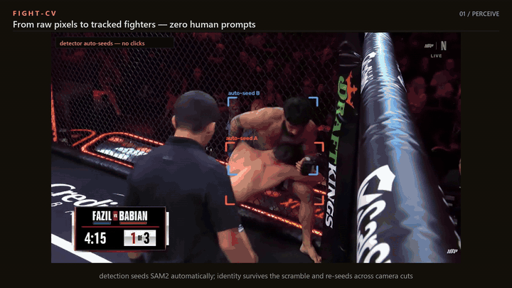

# Fight-CV — fight intelligence from a single broadcast camera

**One camera in → identity-tracked fighters, monocular 3D pose, and a live position/control state machine out.**
This is a public demo slice of a larger private research system, built in under a month and validated against 20-camera mocap ground truth.



**▶ [Full demo — 48 s, 1080p mp4](media/fightcv_demo.mp4)** · [YouTube mirror (unlisted)](https://youtu.be/tjTKaCFnccE)

## What you're watching

1. **Perceive** — a detector auto-seeds SAM2 video segmentation; per-fighter identity persists through takedown scrambles and re-seeds across camera cuts. Zero human prompts anywhere.
2. **Reconstruct** — 3D body recovery (HMR2 backbone) for both fighters from the single broadcast angle; the side panel re-renders the recovered articulation from a free viewpoint. No depth sensor, no rig, no per-broadcast tuning.
3. **Understand** — a geometric state machine turns pose into fight state: standing/clinch → takedown → ground control, per-fighter control clocks, per-frame confidence — and **abstains** (scramble/occluded) when it cannot see.

## The design bet, measured

3D pose through a grapple is an open research problem — the best available models
are still 200+ mm off on occluded joints, and even the ground truth we evaluate
against required a 20-camera rig to construct
([Harmony4D](https://jyuntins.github.io/harmony4d/), real MMA sparring under
synchronized mocap cameras).

So the system is built on a bet: **fight-level conclusions can survive imperfect
pose.** We measured that bet directly:

> Run the *identical* intelligence stack independently from each of the rig's 20
> cameras, and score every frame against the run that uses multi-view ground-truth
> pose (one 149-frame grappling sequence).

| intelligence output | agreement with the ground-truth-pose run |
|---|---|
| **who is in control** | **95–100% (median ≈98%) — every one of 20 viewpoints, no bad angle** |
| ground position class | 85–93% |
| standing vs clinch phase | 67–77% *(monocular depth is the weak axis)* |

This is an **invariance result, not an accuracy claim**: it shows camera placement
does not change the conclusion, and that the conclusion that matters most (control)
is robust to single-camera pose degradation.

### Model-class benchmark — including the failures

Before betting on a backbone, every current model class was evaluated against the
mocap ground truth on the six most-entangled grappling frames (median
root-relative MPJPE; occlusion labeled geometrically by z-buffer, not judgment):

| model class | model | median error | occluded joints | failure mode |
|---|---|---|---|---|
| per-crop single-person | **HMR2** *(chosen)* | **177 mm** | **219 mm** | limb errors in tangles — but always finds both fighters |
| joint multi-person | Multi-HMR (ECCV'24) | 196 mm | 208 mm | **loses an entire fighter in 3/6 frames** (entangled pair fuses into one detection) |
| two-person interaction prior | BUDDI (CVPR'24) | 504 mm | 453 mm | **collapses outright** — a social-interaction prior (hugs, dance) does not transfer to combat grappling |

On a larger clinch window (2 athletes × 120 frames, all 17 joints/frame), the
chosen backbone reaches **229 mm vs 391 mm** occluded-joint error for the CoMotion
baseline (**−41%**).

*Scope, stated plainly: evaluation protocol was frozen (hashed) before
measurement; results are from a single capture; the pre-registered multi-capture
bootstrap is still accumulating. The negative results above are reported because
they are informative — interaction priors and joint detection are the "obvious"
approaches, and they break exactly where fighting is hardest.*

### Read the benchmark as a data assessment

Framed one way, the table above is model selection. Framed the way that
matters, it is a measurement of a **data gap**: the two "smart" approaches —
learned interaction priors and joint multi-person detection — fail precisely on
entangled contact, because the data to learn entangled contact barely exists.
Harmony4D is the best grappling ground truth available and contains roughly
seven distinct captures (one subject-pair each) — a scale limitation we
discovered during protocol design and pre-registered honestly (capture-level
bootstrap, wide CIs) rather than papering over. The scarcity is the finding:
the missing ingredient for models of embodied human contact is exactly the
occlusion-heavy, body-on-body capture that is hardest to collect. The
fine-tune on the roadmap completes this argument — a before/after number
testing whether targeted contact data closes the gap this benchmark measures.

## Architecture

```
broadcast video
  → shot/round segmentation + audio transcript          (00_ingest)
  → detector auto-seed → SAM2 masklets → identity        (pipeline/sam2_track, appearance_identity)
  → per-fighter 3D pose, batched                         (HMR2 runner; fp16, cross-frame batching, 6.7× optimized)
  → height-anchored world placement                      (monocular depth is unreliable → geometric anchoring)
  → position / control / strike / takedown detectors     (ontology-aligned, evidence-strength + abstention)
  → UFCStats-shaped fight report + CV feature vector
```

Every event class in [`ontology/ontology_v1.yaml`](ontology/ontology_v1.yaml)
carries an evidence-strength and an explicit `unknown` arm — occluded or
inconclusive moments are recorded as such, never silently guessed.

## Honest limitations

This section exists because an evaluation program is only useful if it reports
what it found. Known failure modes, all reproduced and documented:

- **Aerial/overhead camera cuts break identity.** From overhead, fighters are
  small and detections latch onto the referee or cageside people; identity can
  also swap silently across a cut. Fix in progress: appearance anchoring +
  re-seeding at scene cuts. (Lesson learned the hard way: patch-scale color is
  *not* identity ground truth — track continuity first, garment features at crop
  scale second. See `demo_renderer/identity_audit.py`, kept as a cautionary
  artifact.)
- **Position sub-classification is not trustworthy yet.** The geometric
  classifier reads back control as side/guard top-control. The demo therefore
  displays only phase + controller — the dimensions verified frame-by-frame.
  Fix: chest-to-back configurations need a torso-orientation check.
- **Standing vs clinch degrades under monocular depth** (67–77% agreement) —
  fighter separation compresses along the camera axis.
- **Validation is single-capture** until the pre-registered multi-capture
  bootstrap completes.
- **Event counts (strikes/takedowns) are not yet validated for zero-shot
  transfer** across promotions/production styles; thresholds tuned on one domain
  over-fire on another. A calibration path against official per-round statistics
  exists and is on the roadmap.
- **Throughput** is ~30–50 min/fight as built; the pose stage was profiled and
  rewritten once already (GPU-starved → batched: 6.7×), the rest is known
  horizontal scaling.

## Repo map

| path | contents |
|---|---|
| [`media/`](media/) | demo video, highlight GIF, ground-truth validation galleries |
| [`ontology/`](ontology/) | the fight-event ontology (YAML + docs + typed Python contracts) |
| [`prereg/`](prereg/) | frozen evaluation protocol (PREREG.yaml + SHA-256 freeze manifest + freezer script) |
| [`pipeline/`](pipeline/) | ingest (shots/transcript), SAM2 tracking, appearance identity, pose render/export runners |
| [`demo_renderer/`](demo_renderer/) | CPU-only compositor that renders the demo video from pipeline artifacts |

## Roadmap

- **Fine-tune the backbone on Harmony4D grappling GT** — feature-cache trainer
  built (frozen ViT-H, head-only sweeps), ~83 training sequences cached,
  subject-disjoint held-out capture; awaiting results.
- **Calibrate event counts against official statistics** on an
  officially-cataloged bout (per-round sig-strikes / takedowns / control time).
- **Back-control classifier** (torso-orientation) + camera-cut identity
  re-seeding.

## Data & rights

Pose validation uses the [Harmony4D](https://jyuntins.github.io/harmony4d/)
dataset (real MMA sparring, 20-camera ground truth); gallery images are derived
from it for research demonstration. Short broadcast excerpts appear in the demo
video for non-commercial research demonstration only; all footage rights remain
with their owners. Code in this repository is MIT-licensed.
